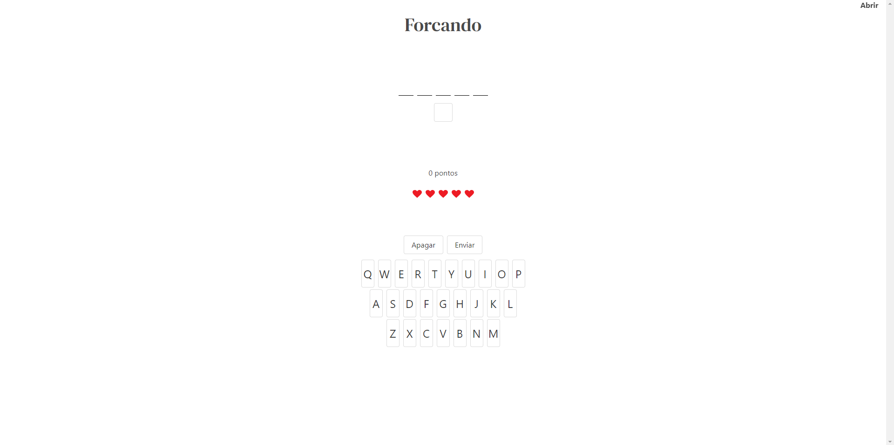
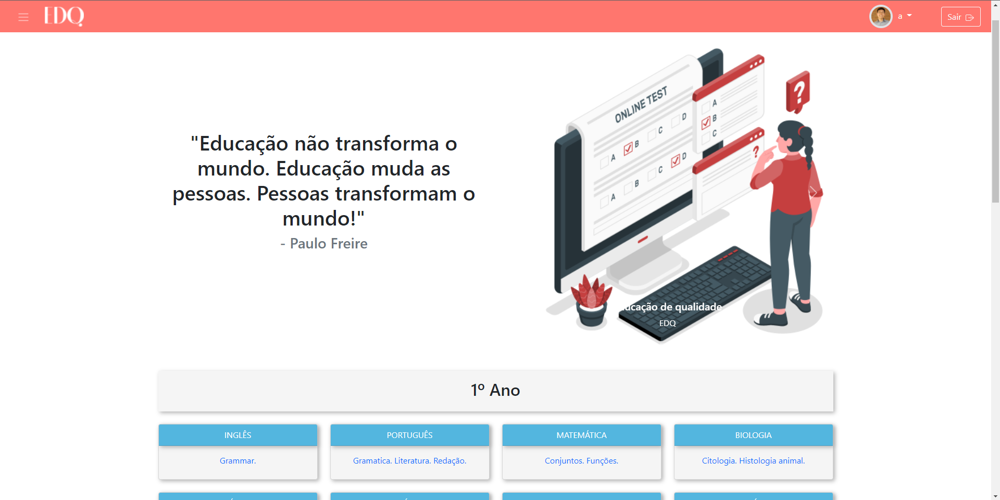

# Hey there, welcome to my github page.
<h2>
<a href="/docs/readme_pt.md">Oiee, se estiver procurando minha pagina em português é só clicar aqui!</a>

</h2>

# Projects

## [Forcando](https://forcando.web.app/)
Forcando is a web game inspired in Wordle and a brazilian game, Jogo da Forca. In this game you can find the word of the day or play infinite round with random words. 
https://forcando.web.app/

- React, Bulma for front-end (JavaScript)
- ExpressJs, cheerioJs for backend (JavaScript)
---

## [EDQ](https://edq-ensino.netlify.app/#/homepage) 

EDQ is a social network design to create an study-friendly space for all students, in EDQ's website all students can access organized classes without any distraction.
This project was created with 5 classmates to summarize all the content in Generation Brazil's bootcamp. 

https://edq-ensino.netlify.app 

https://github.com/JuRibeiro/EDQ-Angular 

https://github.com/Renato-Nakamura/Projeto-integrador

- Angular 2+, Bootstrap for front-end (JavaScript)
- Spring, JPA, MySQL (Java)

# About me
- Started in web development in 2021 at <a href="https://brazil.generation.org/" target="blank">Generation Brasil</a> 
- I'm a curious person and always searching for something new to learn!
- You can see more about me at:
  
   

# Contact

  <a href="mailto:renato.yukio30@gmail.com" target="_blank">
    
  <a/>

# Stats
 

  

